# **Desafio Módulo 3 - Backend**
Este projeto foi implementado no formato de desafio final para aprovação no Módulo 3 do curso de Desenvolvimento de Software com foco em Back-end ofertado pela Cubos Academy por meio da parceria com o Potência Tech - iFood.  

### **Modelo de Trabalho - Pair Programming :busts_in_silhouette: :computer:**
Optamos pela programação em pares para concluir nosso desafio de maneira que o processo se tornaria ágil, combinando nossos conhecimentos, habilidades e perspectivas.  

### **Descrição do desafio**
Construímos uma RESTful API para Controle de finanças pessoais :moneybag:  
As funcionalidades disponíveis são:  
- Cadastrar Usuário
- Fazer Login
- Detalhar Perfil do Usuário Logado
- Editar Perfil do Usuário Logado
- Listar categorias
- Listar transações
- Detalhar transação
- Cadastrar transação
- Editar transação
- Remover transação
- Obter extrato de transações
- Filtrar transações por categoria  
  
Onde qualquer valor monetário devem ser inseridos em centavos e serão retornados também em centavos. (Ex.: R$ 10,00 reais = 1000).

### **Pré-requisitos**  
- Nodejs instalado.
- Banco de Dados Postgres para persistência e manipulação dos dados.
- Beekeeper Studio para interação com o banco de dados.
- Será necessário criar um banco de dados chamado: `dindin` com as tabelas de Usuários, Categorias e Transações. Mas tudo isso pode ser feito com o código disponibilizado no script: `query.sql` e desta forma o seu banco já estará criado e a tabela de categorias populada. 

### **Execução Local**

1. Clonar o projeto:
```bash
git clone https://github.com/biancaaparecida07/desafio-backend-m03-b2bt05.git
```  
2. Abrir a pasta do projeto:
```bash
cd desafio-backend-m03-b2bt05
```  
3. Verificar arquivo `conexao.js`  

Conferir se os campos de `user`, `password` e `port` do arquivo `conexao.js`  estão de acordo com as informações configuradas no momento da instalação do Postgres  

4. Instalar dependências:  
```bash
npm install
```  
5. Inicializar o servidor:
```bash
npm run dev
```  
### **Teste de funcionalidades**  
A aplicação estará disponível no endereço local: `http://localhost:3000`. Suas funcionalidades podem ser testadas com as rotas mencionadas na seção de [Funcionalidades](#funcionalidades).

### **Funcionalidades**
### Cadastrar usuário

#### `POST` `/usuario`

Essa é a rota que será utilizada para cadastrar um novo usuario no sistema.

- **Requisição**  
  O corpo (body) deverá possuir um objeto com as seguintes propriedades:  
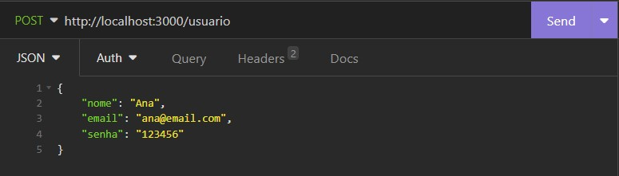  
O retorno desta requisição, em caso de sucesso, exibirá os dados de entrada (exceto a senha) junto ao ID do usuário.  
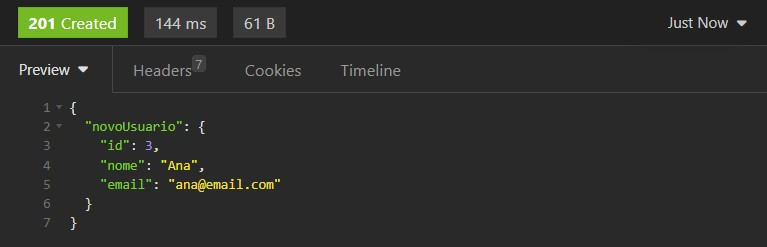  

### Login do usuário

#### `POST` `/login`

Essa é a rota que permite o usuario cadastrado realizar o login no sistema.

- **Requisição**  
  O corpo (body) deverá possuir um objeto com as seguintes propriedades (respeitando estes nomes):
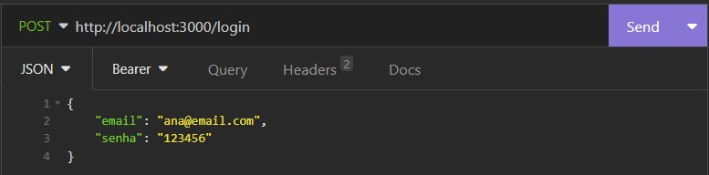  
O retorno desta requisição, em caso de sucesso, exibirá os dados do usuário junto ao seu token de acesso às demais funcionalidades.  
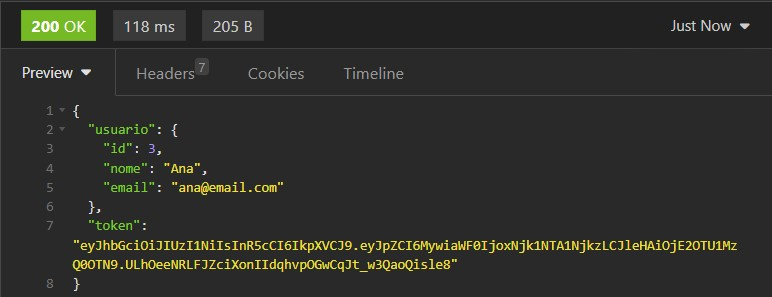  

### Como utilizar o token de acesso  
O token de acesso para as demais funcionalidades deve ser disponibilizado no header com o formato Bearer Token. No Insomnia, será da seguinte forma: 
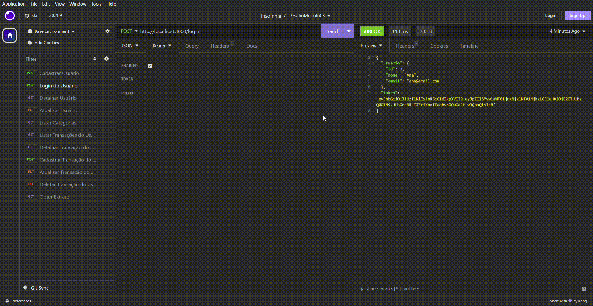  
Quando enviado, o token é validado e também verificado qual usuário do banco está vinculado ao mesmo pelo ID.  

### Detalhar usuário  
#### `GET` `/usuario`

Essa é a rota para quando o usuario quiser obter os dados do seu próprio perfil.  
**Atenção:** Certificar-se de que o token de autenticação está sendo enviado. 

- **Requisição**  
Neste caso, não deverá possuir conteúdo no corpo da requisição.    
Para esta funcionalidade, a resposta em caso de sucesso apresentará os dados do usuário com exceção de sua senha.  
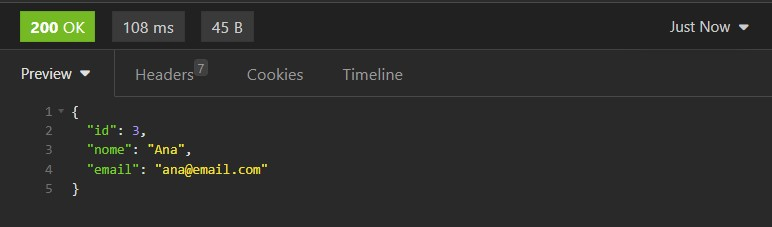  

### Atualizar usuário

#### `PUT` `/usuario`

Essa é a rota para quando o usuário quiser realizar alterações no seu próprio usuário.  
**Atenção:** Certificar-se de que o token de autenticação está sendo enviado.


- **Requisição**  
  O corpo (body) deverá possuir um objeto contendo os novos dados de nome, email e senha.
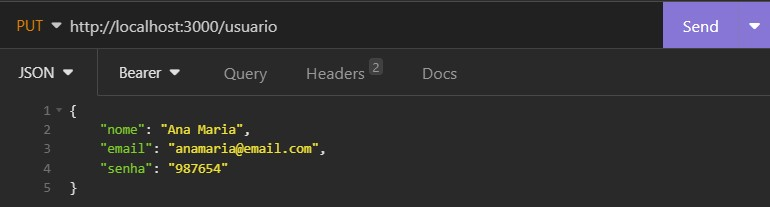  
Nesta funcionalidade é certificado se o email informado já está cadastrado e por consequência não possa ser utilizado. Então, é enviado uma mensagem informando esta ocorrência. Em caso de sucesso, nenhuma mensagem é enviada.  
  
### Listar categorias

#### `GET` `/categoria`

Essa é a rota para quando o usuario logado quiser listar todas as categorias cadastradas para consulta.  
**Atenção:** Certificar-se de que o token de autenticação está sendo enviado. 

- **Requisição**  
  Não é necessária nenhuma informação além do token de autenticação.  
  Como resposta, as categorias são exibidas em formato de array de objetos, tendo cada categoria o seu próprio ID de referência. 
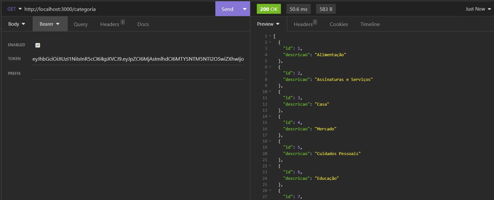  

### Cadastrar transação para o usuário logado

#### `POST` `/transacao`

Essa rota será utilizada para cadastrar uma transação associada ao usuário logado.  
**Atenção:** Certificar-se de que o token de autenticação está sendo enviado. 


- **Requisição**  
  O corpo (body) da requisição deverá possuir um objeto com as seguintes propriedades:
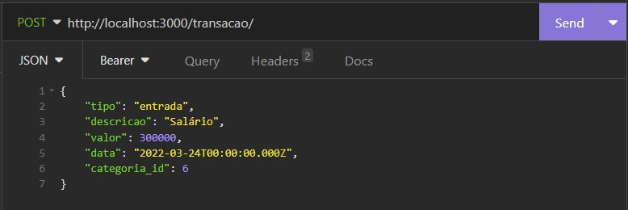  
As informações serão validadas como nos endpoints anteriores e para este em específico, também será verificada se existe a o id informado para categoria da transação bem como se o tipo da transação foi devidamente preenchido como `entrada` ou `saida`. 
O retorno em caso de sucesso, conterá as informações da transação cadastrada, incluindo seu respectivo `id`.  
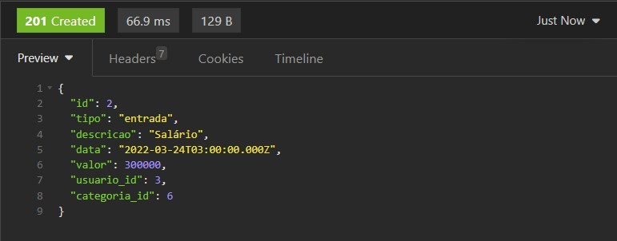  

### Listar transações do usuário logado

#### `GET` `/transacao`

Essa é a rota para quando o usuario logado quiser listar todas as suas transações cadastradas.  
**Atenção:** Certificar-se de que o token de autenticação está sendo enviado. 

- **Requisição**  
  Não é necessária nenhuma informação além do token de autenticação, pois além de dar permissão ao usuário para fazer uso da funcionalidade, ele possui o ID utilizado para busca das transações.  
  Como retorno, teremos todas as transações feitas pelo usuário no formato de array de objetos. 
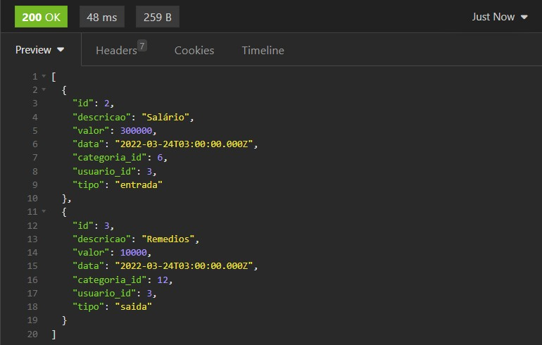  

### Detalhar uma transação do usuário logado

#### `GET` `/transacao/:id`

Essa é a rota para quando o usuario logado quiser obter uma das suas transações cadastradas.  
**Atenção:** Certificar-se de que o token de autenticação está sendo enviado. 
- **Requisição**  
  Deverá ser enviado o ID da transação no parâmetro de rota do endpoint como pode ser visto abaixo.  
  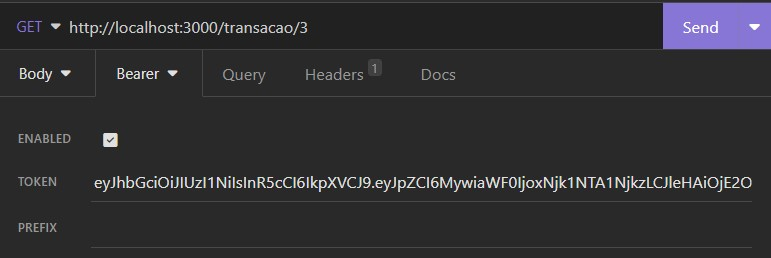  
  O retorno para o caso de sucesso (ID válido e transação pertencente ao usuário logado), será um objeto contendo as informações da transação realizada.
  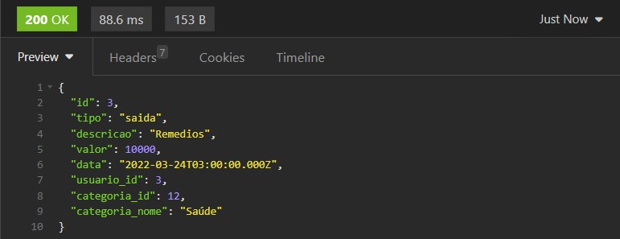  

### Atualizar transação do usuário logado

#### `PUT` `/transacao/:id`

Essa é a rota para quando o usuario logado quiser atualizar uma das suas transações cadastradas.  
**Atenção:** Certificar-se de que o token de autenticação está sendo enviado. 

- **Requisição**  
  Deverá ser enviado o ID da transação como parâmetro de rota. E além disso, no corpo (body) da requisição deverá possuir um objeto com as seguintes propriedades:  
  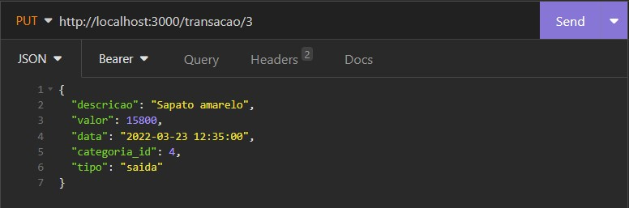  
  O retorno será vazio para o caso de sucesso. As validações serão basicamente as mesmas do endpoint de cadastro de transação. Será possível verificar a alteração da transação acessando também o banco de dados na tabela de transações. 

### Excluir transação do usuário logado

#### `DELETE` `/transacao/:id`

Essa é a rota para quando o usuario logado quiser excluir uma das suas transações cadastradas.  
**Atenção:** Certificar-se de que o token de autenticação está sendo enviado. 

- **Requisição**  
Deverá ser enviado o apenas o ID da transação como parâmetro de rota.  
  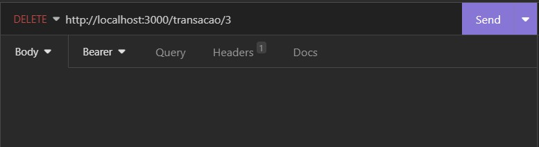  
  O retorno será vazio para o caso de sucesso. Será possível verificar a alteração da transação acessando também o banco de dados na tabela de transações. Mas a caráter de exemplo, seguindo as imagens desta documentação, quando listamos as transações, a transação excluída já não é mais listada. 
  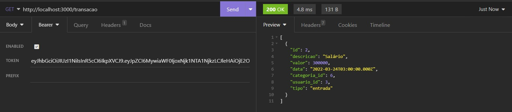  

### Obter extrato de transações

#### `GET` `/transacao/extrato`

Essa é a rota para quando o usuario logado quiser obter o extrato de todas as suas transações cadastradas.

- **Requisição**  
  Nada além do token de acesso é requisitado.  
  Como retorno, é exibido um objeto contendo a soma de todas as transações do tipo `entrada` e a soma de todas as transações do tipo `saida`.  
  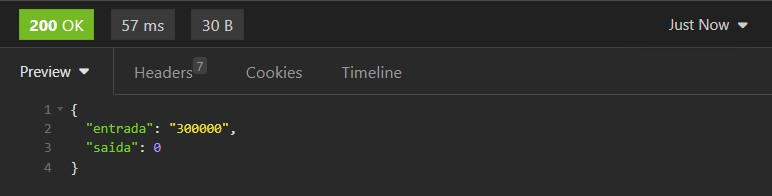  

## ✒️ Autoras
[Bianca Aparecida](https://github.com/biancaaparecida07)  
[Emanuelle Cruz](https://github.com/manuscruz)  

###### tags: `back-end` `módulo 3` `nodeJS` `PostgreSQL` `API REST` `desafio` `bancodedados` 

